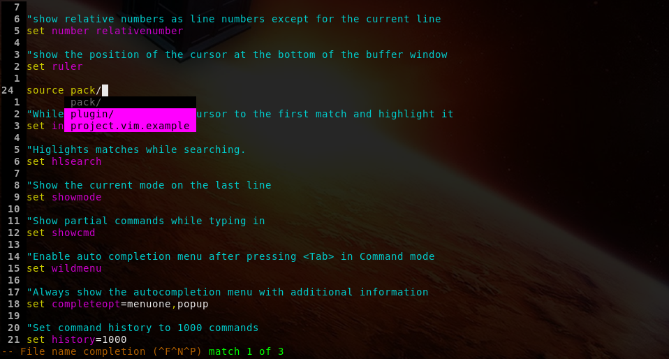

# my-vim-config
My vim configuration supporting web development.
The goal is to use as few plugins as possible.

## License

This work is provided under the terms of the MIT license. Please take a look at
the LICENSE file for the full text.

## Features

* Many settings to facilitate your live as a web developer.
* Integrated PHP linter and codesniffer taking advantage of the quickfix list.
* Baked-in JavaScript linter and a unit testing framework for JavaScript.
* Integrated spell checking.
* Rendering markdown files as HTML.
* Automatically loading project-specific configuration files.

## Technology

To use all the implemented features the following external programs are needed.
The configuration has been tested with the specified versions:

* VIM - Vi IMproved 8.2
* ESLint 8.8 (https://eslint.org/)
* GNU Aspell 0.60 (http://aspell.net/)
* Grip 4.6 (https://github.com/joeyespo/grip)
* Mocha 9.2 (https://mochajs.org/)
* PHP 7.4 (https://www.php.net/)
* PHP_CodeSniffer 3.5 (https://github.com/squizlabs/PHP_CodeSniffer)

## Installation

Clone this git repository and place or link the repository folder under the
name ".vim" in your home directory.

## Using
Please check the vim configuration files.

## Contact

If you have any question, just drop a message at
thorres [at] brothersofgrey [dot] net.
